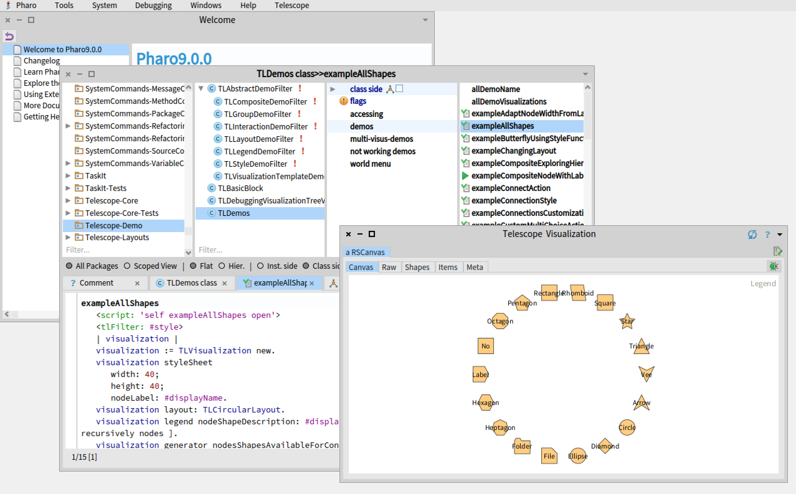
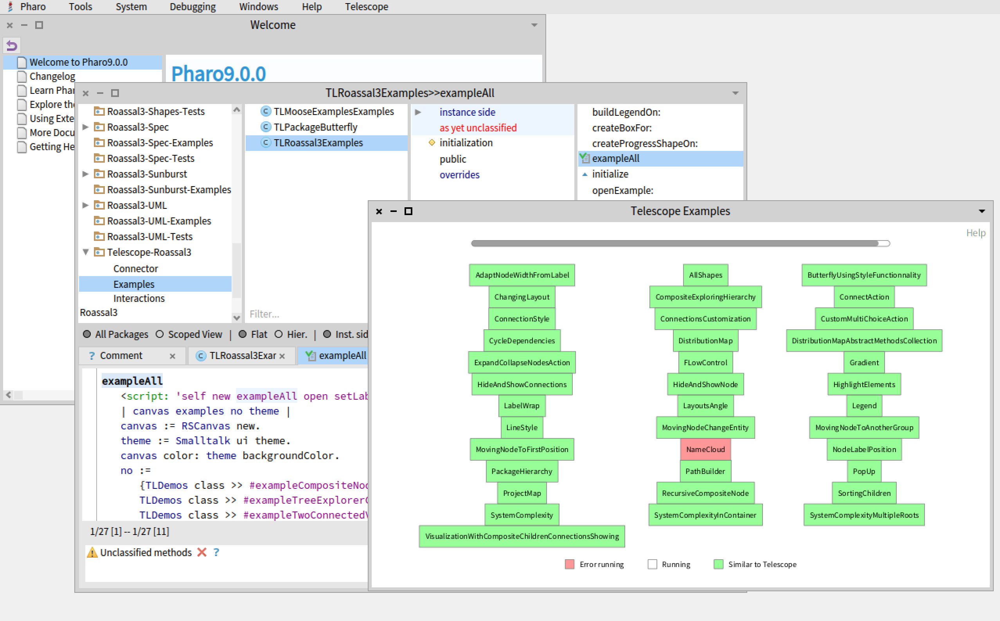
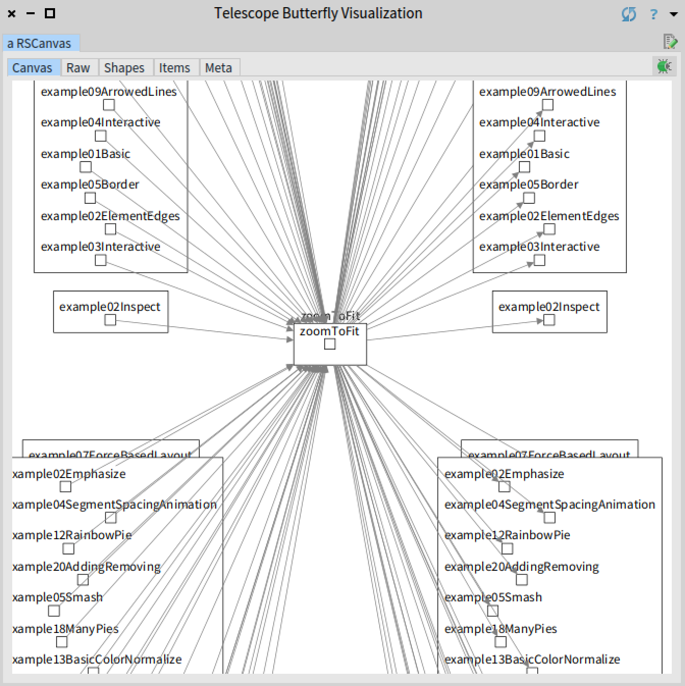

# TelescopeRoassal3
[](https://travis-ci.com/bergel/TelescopeRoassalBridge)

A connector to Roassal3 graphic engine

## Installation

To install Telescope and the Roassal3, you simply need to execute the following code snippet in a playground in Pharo 8:
```Smalltalk
Metacello new
    baseline: 'TelescopeRoassal3';
    repository: 'github://TelescopeSt/TelescopeRoassal3';
    load.
```

In Pharo 9, you may want to use the following script (in order to avoid odd warnings from Metacello):

```Smalltalk
[Metacello new
    baseline: 'Roassal3';
    repository: 'github://ObjectProfile/Roassal3';
    load ] on: MCMergeOrLoadWarning do: [:warning | warning load ]
```  

Note that this code snippet also loads Telescope, there is no need to load [Telescope](https://github.com/TelescopeSt/Telescope) therefore.

## Demos

Once you have the TelescopeRoassal bridge loaded, it will be used by Telescope itself to render visualization. You can browse the class `TLDemos`, on the class side, to run all the demos of Telescope using the Roassal3 bridge. Here is a screenshot:



The class `TLRoassal3Examples` gives an overview of how well the Telescope standard example run using the Roassal3 bridge. By running the method `exampleAll`, you will obtain something like:


Each box is an example of Telescope that is run using the Roassal3 bridge. A green box indicates the example runs without error. A red box indicates an error is thrown. In this case, the class `TLNameCloud` uses the `logCr` message, which does not exist in Pharo 9 (from which the screenshot is obtained from).

The Roassal3 bridge contains the class `TLPackageButterfly` that defines the butterfly visualization. As shown in the method `TLMooseExamplesExamples>>exampleMyClassButterfly`, one can open the butterfly visualization on any Pharo compiled method using:

```Smalltalk
	b := TLPackageButterfly new.
	b
		mainEntity: RSCanvas >> #zoomToFit;
		leftEntities: [ :met | met senders collect: #compiledMethod ];
		rightEntities: [ :met | met implementors collect: #compiledMethod ].
	b 
```


In case you are using Moose, here is a similar example that uses the Moose platform instead:
```Smalltalk
	parser := CPPSCSVParser new.
	model :=  CPPSModel new.
	parser model: model.
	parser entitiesMap
		at: 'Class'
		put:
			(CPPSType new
				name: 'MyClass';
				sourceAnchor: (CPPSFileAnchor new mooseModel: model)).
				
	parser entitiesMap at: 'typeCode' put: CPPSType new.
	parser savePath: 'foo/bar' forId: 'sourceFile'.
	context := PP2Context new.
	parser := parser productionAt: #function.

	result := parser 
		parse: 'methodCode,"myMethod()",typeCode,Class,sourceFile,45,1,48,-1'
		withContext: context.
	entity := model entityNamed: 'MyClass.myMethod()'.

	butterfly := CPPSButterflyVisualization new
		mainEntity: entity.
	butterfly open.
```    
